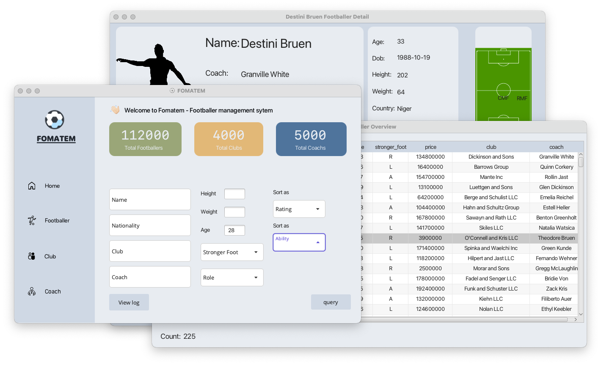
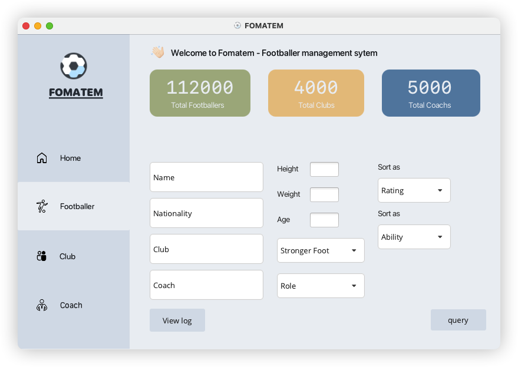

# Football Management System ⚽🏟️ 

An application to manage fooballer's information. Use [PostgreSQL](https://www.postgresql.org/) as local database.



# Features

+ Connect to local database `footballer_manager` via login scene
+ Over 112000 players, 4000 clubs and 5000 total coachs (*notes that all are sample data*)
+ List footballer's information overview as required
+ View footballer's information detail (also with club and coach)
+ View log of each action modifying infomation
+ Cross platform (with all requirements :v)

You can see showcase of the application in [showcase](./showcase.md)
# Documentation

Read [wiki](https://github.com/betty2310/FOMATEM/wiki) for more details.

# Installing

## Requirements

+ [PostgreSQL](https://www.postgresql.org/): relational database management system.
    + Check command `psql --version`
+ [JDK](https://www.oracle.com/technetwork/java/javase/downloads/index.html): Java Development Kit.
    + Check command `java -version`
+ [JavaFX](https://www.oracle.com/java/technologies/javafx/overview.html): JavaFX is a Java-based framework for building user interfaces.
    + Unzip file, and remember path of lib folder.

## Steps

1. `clone` this project
   ```bash
   $ git clone https://github.com/betty2310/FOMATEM
   ```
2. Dowload lasted [release](https://github.com/betty2310/FOMATEM/releases) 
2. Create local database in your machine
    ```bash
    $ createdb football_manager
    $ cd FOMATEM/sql/
    $ psql -d football_manager -f createDB.sql
    $ psql -d football_manager -f function_trigger.sql
    $ psql -d football_manager -f view.sql
    $ cd ../data
    $ psql -d football_manager -f ../sql/getData.sql
    ```
3. Run the application
    ```bash
    $ java -jar App.jar --module-path PATH_TO_JAVAFX --add-modules=javafx.controls,javafx.fxml
    ```
    Replace `PATH_TO_JAVAFX` to path of lib **javafx** folder I mentioned before.

Congrats! You can now use this app.


## Using docker

- [ ] In progress

# Author

**Fomatem** is developed and maintained by [Huynh Duong](https://github.com/betty2310).

# Contributing

Contributing is always welcome. Please feel free to open an issue or create a pull request.

# Special Thanks & Credits

+ [@Dao Kim Duong](https://github.com/kimduong322?fbclid=IwAR213U6fy_Q6Kvfm4b08EatKH006sv9EFKX0VV2cfcsfeBmLwCs7oSvIYYw) and [@Nguyen Hoang Hieu](https://github.com/hieu748159263) for over 30 sql commands to query database.
+ [@AmirUCR](https://github.com/AmirUCR/jdbc_mechanic_shop.git) for [jdbc_mechanic_shop]() project - it helped me to understand how to use JDBC, JavaFX to build an application.
+ Using icon from [FontAwesome](https://fontawesome.com/) and website [Icons8](https://icons8.com/).
+ [MaterialFX](https://materialfx.io/) for beatiful design of button, table,....
+ [Synth](https://github.com/shuttle-hq/synth) for generate a lot of data to my database.

# License

This project is licensed under the [MIT](https://github.com/betty2310/FOMATEM/blob/main/LICENSE) license.

