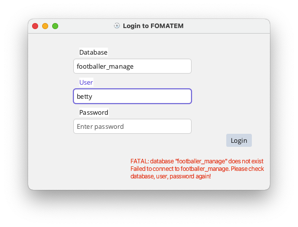

# Some images about FOMATEM

**Login**

*Wait a second* (the gif's size is large) 😅

## Footballer

1. Menu

2. Overview selected footballer

3. Detail selected footballer

## Club

## Coach

Basically, **Club** and **Coach** has the same overview and detail like **Footballer**. See [wiki](https://github.com/betty2310/FOMATEM/wiki) for more detail.
